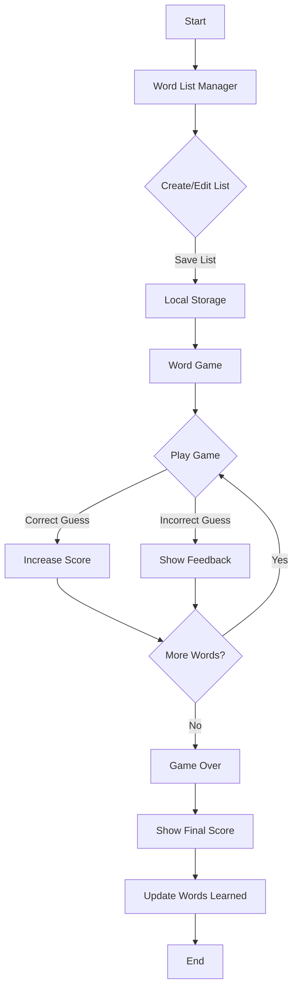

# Word Wizard: Interactive Word Learning Game

Word Wizard is an engaging React application designed to help children aged 5-10 learn new words through an interactive and fun game interface. The application consists of two main components: a word list manager for parents and a word game for children.

## Application Structure

The application is built using React with TypeScript and utilizes Tailwind CSS for styling. It consists of two main components:

1. **WordListManager**: Allows parents to create, edit, and manage word lists.
2. **WordGame**: Presents a game interface for children to play with the created word lists.

## Flow Diagram



## Development Process

1. **Project Setup**: 
   - Initialized a new React project using Vite with TypeScript support.
   - Set up Tailwind CSS for styling.

2. **Component Development**:
   - Created the `WordListManager` component for managing word lists.
   - Developed the `WordGame` component for the interactive game interface.

3. **State Management**:
   - Utilized React hooks (useState, useEffect) for local state management.
   - Implemented local storage to persist word lists between sessions.

4. **Routing**:
   - Used React Router (HashRouter) for navigation between the word list manager and the game.

5. **Game Logic**:
   - Implemented word scrambling, guessing, and scoring mechanisms.
   - Added features like hints, text-to-speech, and achievements for enhanced interactivity.

6. **Styling and UI**:
   - Applied Tailwind CSS classes for responsive and attractive design.
   - Used Lucide React icons for visual elements.

7. **Error Handling and Feedback**:
   - Implemented user feedback mechanisms for correct and incorrect guesses.
   - Added loading states and error messages for improved user experience.

8. **Enhancements**:
   - Limited word lists to 10 words each with a warning message.
   - Added status indicators for played lists and words learned.
   - Implemented achievements and streaks to make the game more engaging.
   - Used animations to make the game visually appealing for kids.

## How to Run Locally

To run this application on your local machine, follow these steps:

1. Clone the repository to your local machine.

2. Navigate to the project directory in your terminal.

3. Install the dependencies:
   ```
   npm install
   ```

4. Start the development server:
   ```
   npm run dev
   ```

5. Open your web browser and visit the URL provided by Vite (usually `http://localhost:5173`).

6. You should now see the Word Wizard application running locally. Start by creating a word list in the Word List Manager, then play the game by clicking on the "Play" button next to a word list.

Enjoy playing and learning with Word Wizard!